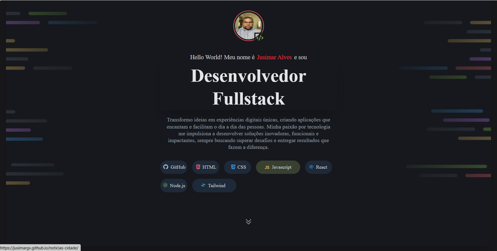

# Projeto Portfolio



Este é um portfólio profissional desenvolvido em React, com foco em apresentar projetos, habilidades e formas de contato de maneira moderna e responsiva.

## 🚀 Tecnologias Utilizadas
- React
- Tailwind CSS
- Vite

## 💻 Como rodar o projeto

1. **Clone o repositório:**
   ```bash
   git clone https://github.com/jusimargv/seu-repo.git
   ```
2. **Acesse a pasta do projeto:**
   ```bash
   cd Projeto_portfolio
   ```
3. **Instale as dependências:**
   ```bash
   npm install
   ```
4. **Inicie o servidor de desenvolvimento:**
   ```bash
   npm run dev
   ```
5. Abra o navegador em `http://localhost:5173` para visualizar.

## 🤝 Como contribuir

1. Faça um fork do projeto
2. Crie uma branch para sua feature (`git checkout -b minha-feature`)
3. Faça commit das suas alterações (`git commit -m 'feat: Minha nova feature'`)
4. Faça push para a branch (`git push origin minha-feature`)
5. Abra um Pull Request

## 📄 Licença

Este projeto está licenciado sob a licença MIT. Veja o arquivo [license.txt](license.txt) para mais detalhes.
